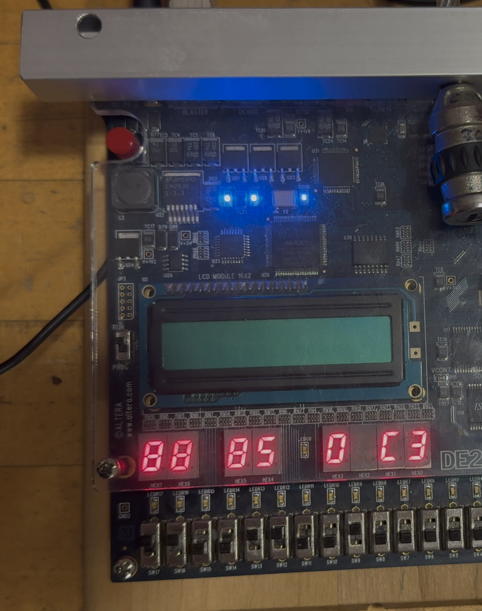
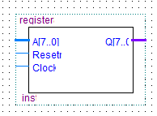
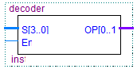
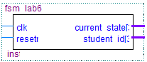
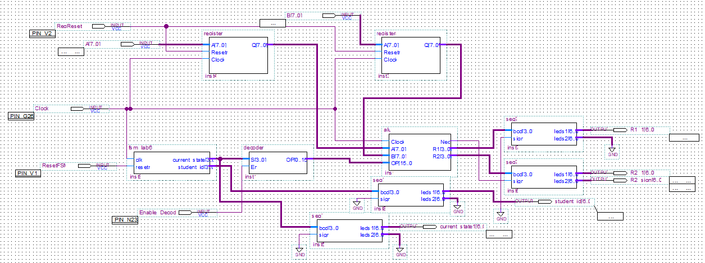
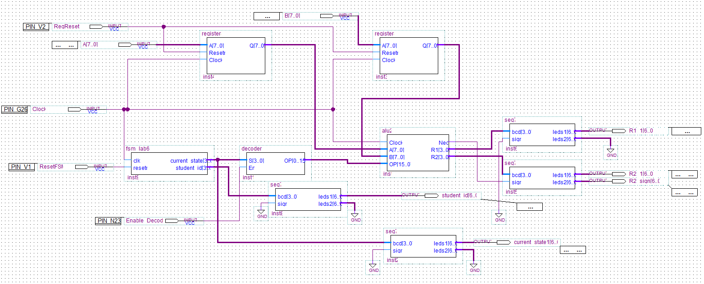
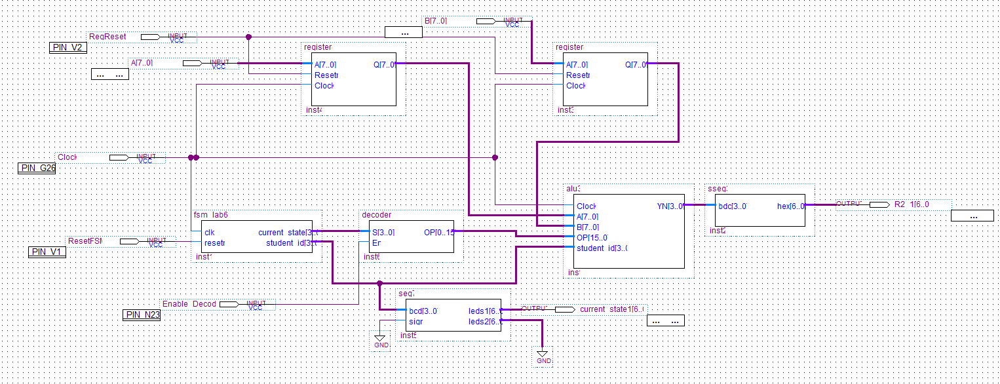

# Microcoded General-Purpose Processor

A general-purpose processor designed in VHDL and deployed to an **Altera DE2 FPGA**,
built from discrete components rather than an off-the-shelf core: two storage latches,
a finite state machine, a 4-to-16 decoder generating microcode, and an ALU whose
operation is selected entirely by that microcode.

Built for COE 328 (Digital Systems) at Toronto Metropolitan University, Fall 2025.



*Running on hardware. The left seven-segment pair shows the FSM's current state output;
the right pair shows the ALU result in hexadecimal — here `C3`, the output of operation #9.*

---

## Architecture

Two 8-bit operands are latched, the FSM sequences through its states, the decoder turns
each state into a one-hot microcode word, and that word selects which ALU operation runs.
The result is converted to hexadecimal and driven onto the seven-segment displays.

```
        A[7..0] ──► Latch 1 ──┐
                              ├──► ALU core ──► result[7..0] ──► hex ──► 7-segment
        B[7..0] ──► Latch 2 ──┘         ▲
                                        │ microcode[15..0]
    clk ──► FSM ──► state[3..0] ──► 4:16 decoder
```

| Component | Function |
|---|---|
| **Latch 1 / Latch 2** | Positive-edge 8-bit registers holding operands A and B. Output holds while the clock is low; data passes on the rising edge. |
| **FSM** | Nine states, advancing on the clock. Emits a 4-bit current-state value. |
| **4:16 Decoder** | Converts the 4-bit state into one of sixteen one-hot lines — a 16-bit microcode word. Gated by an enable input. |
| **ALU core** | Executes one of nine arithmetic and logical operations, chosen by the microcode word. 8-bit result. |
| **Seven-segment driver** | Converts the 8-bit result to hexadecimal for display. |

<p float="left">
  
  
  
</p>

### Microcode mapping

The decoder makes the control path trivially extensible: each state maps to exactly one
microcode bit, and the ALU decides behaviour from that bit alone.

| State (dec) | State (bin) | Microcode `[15..0]` |
|---|---|---|
| disabled | x | `0000 0000 0000 0000` |
| 0 | `0000` | `0000 0000 0000 0001` |
| 1 | `0001` | `0000 0000 0000 0010` |
| 2 | `0010` | `0000 0000 0000 0100` |
| 3 | `0011` | `0000 0000 0000 1000` |
| 4 | `0100` | `0000 0000 0001 0000` |
| 5 | `0101` | `0000 0000 0010 0000` |
| 6 | `0110` | `0000 0000 0100 0000` |
| 7 | `0111` | `0000 0000 1000 0000` |
| 8 | `1000` | `0000 0001 0000 0000` |

After state 8 the FSM wraps to state 0.

---

## Three ALU variants against one control path

The processor was extended three times. Each variant changed **only the ALU and its
microcode assignments** — the latches, FSM and decoder were untouched. That is the point
of a microcoded design: the instruction set grows without redesigning the datapath.

| Variant | Added capability |
|---|---|
| **1** | Nine arithmetic and logic operations — addition, subtraction, and boolean functions |
| **2** | Shift, rotate, bit-reversal, and `min(A, B)` |
| **3** | State-dependent conditional evaluation |

<p float="left">
  
  
  
</p>

---

## A timing difference that only appeared on hardware

Simulation agreed with the theoretical timing. On the DE2 it did not: the hexadecimal
result trailed the expected value by one clock cycle.

The cause was the split between the two logic blocks. The control unit updates first, and
its output only reaches the ALU on the *following* rising edge — so the ALU is always
evaluating the previous cycle's microcode. The behaviour is correct; the propagation
through two sequential stages simply is not free, and a timing diagram drawn as though
control and datapath settle together will not predict it.

Worth recording because it is the kind of discrepancy that never shows up until a design
leaves simulation and runs on real silicon.

---

## Tools

VHDL · Intel Quartus Prime · Altera DE2 (Cyclone II) · schematic block design (BDF)
for top-level integration · Quartus waveform simulation

## Notes

- **Source is not published here.** This repository documents the design; the VHDL
  remains coursework for an active course. Happy to walk through the implementation
  in an interview.
- The seven-segment display driver was provided in the course, not authored here.
- Completed with a lab partner; the FSM, decoder, ALU variants and hardware bring-up
  described above are joint work.

© 2025 Gurjot Singh Dhillon. Documentation and figures only.
